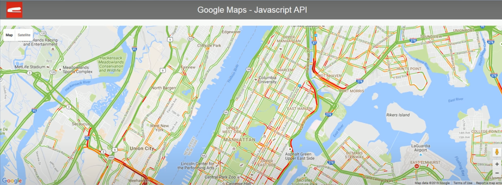
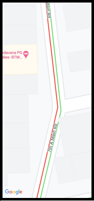
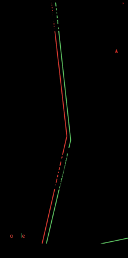

# IMPLEMENTATION
## SOFTWARE- ARTIFICIAL INTELLIGENCE IMPLEMENTATION
### 1)Detecting Traffic
We leverage the Google Java Script Api to obtain the real time traffic conditions of a certain area which is displayed as traffic layers on google maps. The traffic layer is mainly in three colours-red for heavy traffic, orange/yellow for average and green for low traffic.

### 2)Deciding the movement of median
After getting the live traffic data we make use of OpenCV library on Python to zoom into each road and detect the colours of the road. If a red and green are detected on the same road then the median is made to move towards the green side. If both are green or both red then no movement takes place.

    
